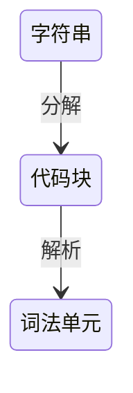
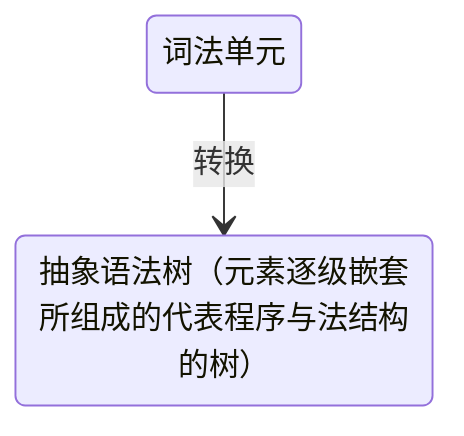
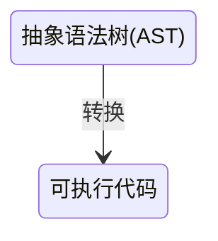

# 前言
<font color=#999AAA >
这个分栏用于记录最近在看的《你不知道的JavaScript》系列的笔记内容，更接近于理论篇，所以为了加深记忆，会摘抄书上我认为重要的部分，也会尽可能的用自己的理解去重载内容
</font>

****
# 编译原理
## 分词/词法分析（Tokenizing/Lexing）


<!--more-->

## 解析/语法分析(Parsing)


## 代码生成

****


# 作用域
>- 引擎： 从头到尾负责整个js程序的编译及执行
>- 编译器： 语法分析及代码生成
>- 作用域： 收集并维护所有生命的标识符组成的一系列查询，并实施严格的规则，确定当前执行的代码对这些标识符的访问权限


>var a = 2; 
>代码生成过程是:
>1、先执行 var a ，编译器向作用域询问是否有重名变量，有则无操作，**没有则在当前作用域的集合中声明新变量，并命名为a**
>2、编译器为引擎生成执行代码，首先询问当前作用域是否存在叫a的变量，存在则使用这个变量，不存在则向上级作用域寻找，如果找到则赋值，否则抛出异常

**** 
# 赋值
- LHS：查找赋值左侧的变量，找到变量的容器本身，即赋值操作的目标是谁
- RHS：非左侧的变量，查找变量的值，即谁是赋值操作的源头

```javascript
function foo(a){
console.log(a);
}
foo(2)
```

**形参a=2的赋值为隐式**


